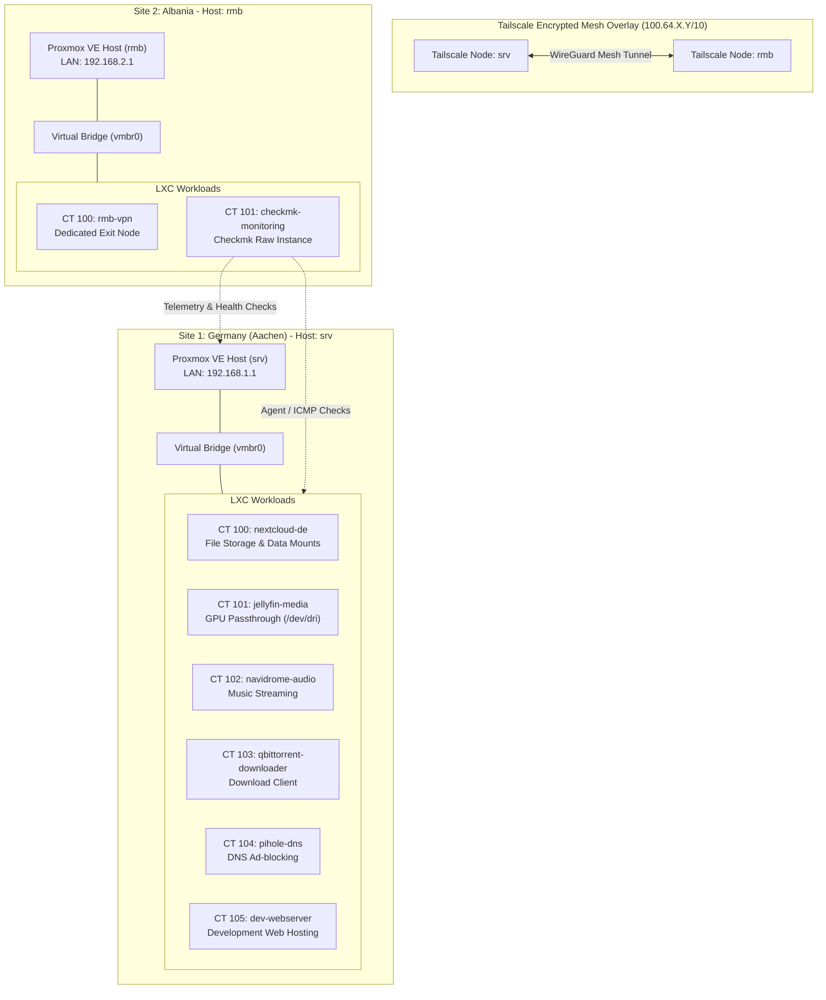

# 🖥️ Multi-Site Home Lab Infrastructure

[](https://www.proxmox.com/)
[](https://tailscale.com/)
[](https://linuxcontainers.org/)
[](https://www.debian.org/)
[](https://github.com/besmirkodra/homelab-project)

A documented, self-hosted multi-site infrastructure topology featuring virtualized nodes, LXC containers, secure cross-site mesh networking, self-hosted media and storage services, and local DNS ad-blocking, spanning Germany and Albania..


---

## Interactive Architecture & Network Diagram


---

## Infrastructure Overview

* **German Node (`srv`):** Primary hosting node in Germany for media streaming, Nextcloud file management, torrenting, and local web development workloads.
* **Albanian Node (`rmb`):** Edge service node in Albania running a dedicated Tailscale Exit Node and Checkmk infrastructure monitoring instance.
* **Inter-Site Connectivity:** Encrypted Tailscale mesh overlay interconnecting isolated local subnets across international sites.

---

## Repository Structure

```text
├── docs/
│   ├── network-topology.md      # Tailscale mesh routing and subnet breakdown
│   ├── checkmk-monitoring.md    # Cross-site telemetry and agent configuration
│   └── storage-architecture.md  # Storage mounts and GPU passthrough (/dev/dri)
├── proxmox/
│   ├── german-node-srv/configs/ # LXC container configuration templates (100–105)
│   └── albanian-node-rmb/configs/# LXC container configuration templates (100–101)
├── tailscale/                   # Mesh routing policies and ACL definitions
└── scripts/                     # Infrastructure maintenance and backup scripts
```

---

## Documentation Quick Links

* [Network Topology & Routing Architecture](docs/network-topology.md)
* [Checkmk Infrastructure Monitoring Setup](docs/checkmk-monitoring.md)
* [Storage Layout & Hardware Passthrough](docs/storage-architecture.md)
